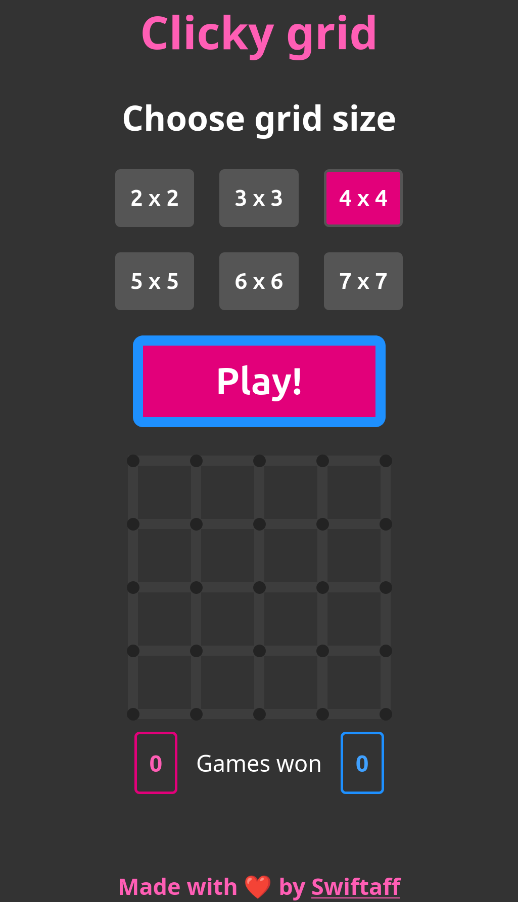
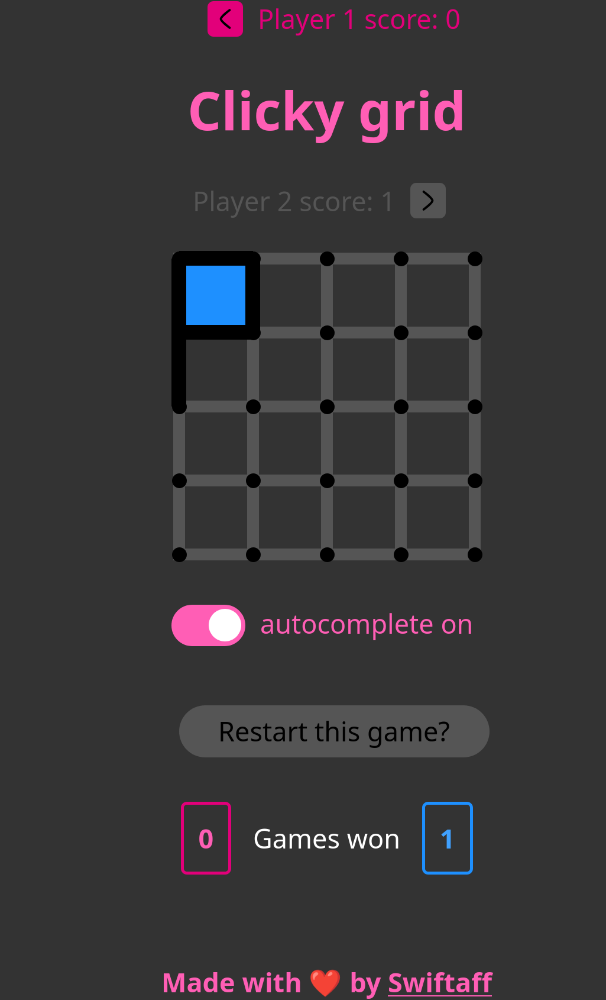
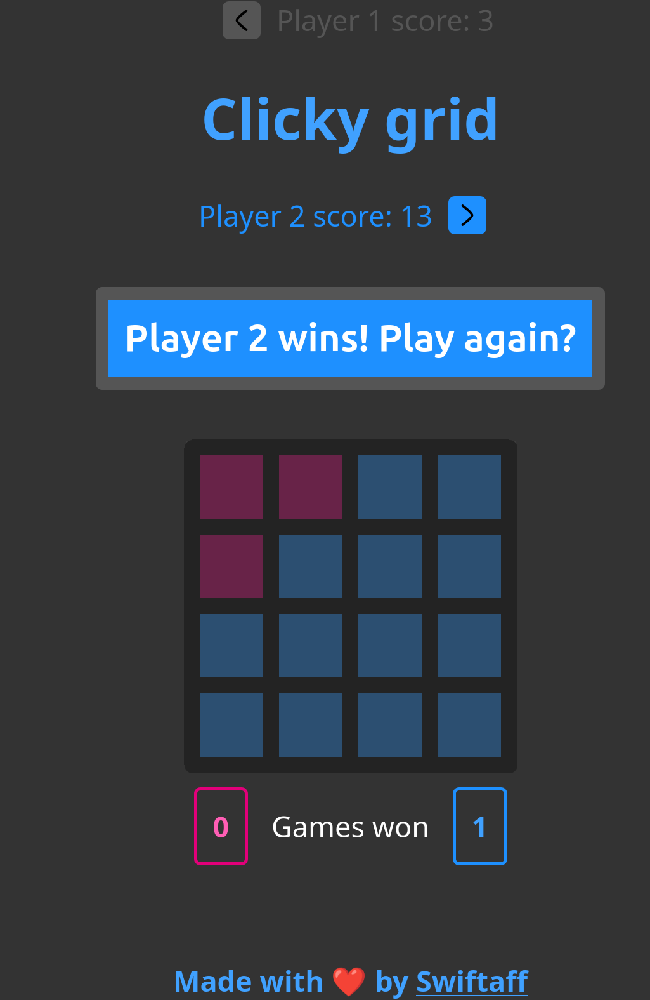

# Clicky grid

A simple, fun, classic, two-player game where you strategically click lines to capture more boxes than your opponent.

Demo: [https://clicky-grid.vercel.app](https://clicky-grid.vercel.app)

|  |  |  |
|:--:|:--:|:--:|


## Installation

The `src` directory is a no-build static site, using just HTML, CSS, and reactive interface using [Alpine JS](https://alpinejs.dev).

But you can run a local server using e.g. sirv-cli (and nodejs and npm)
```
npm i
npm run run
```

## License
This project is licensed under the MIT License.
